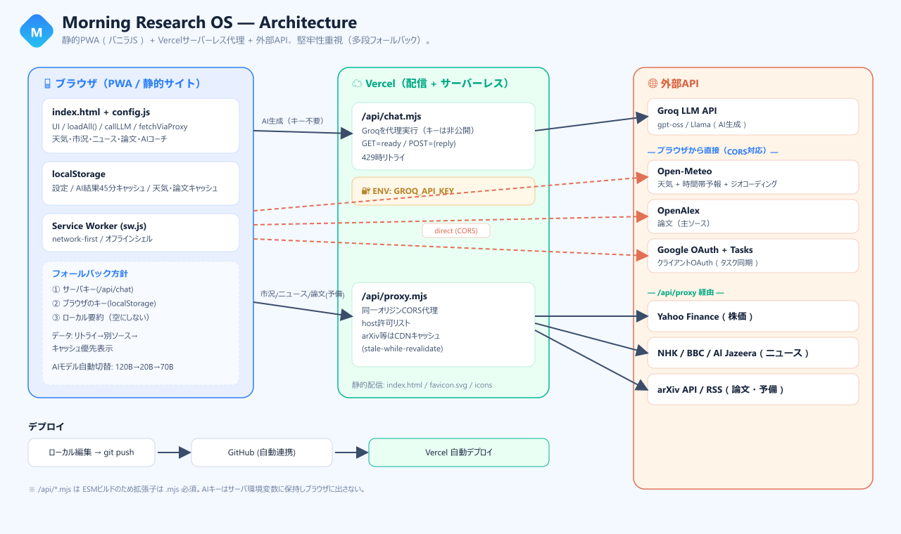
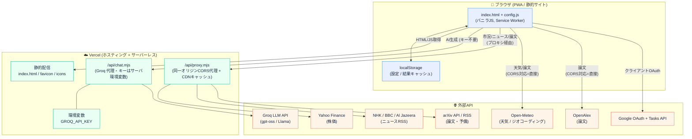
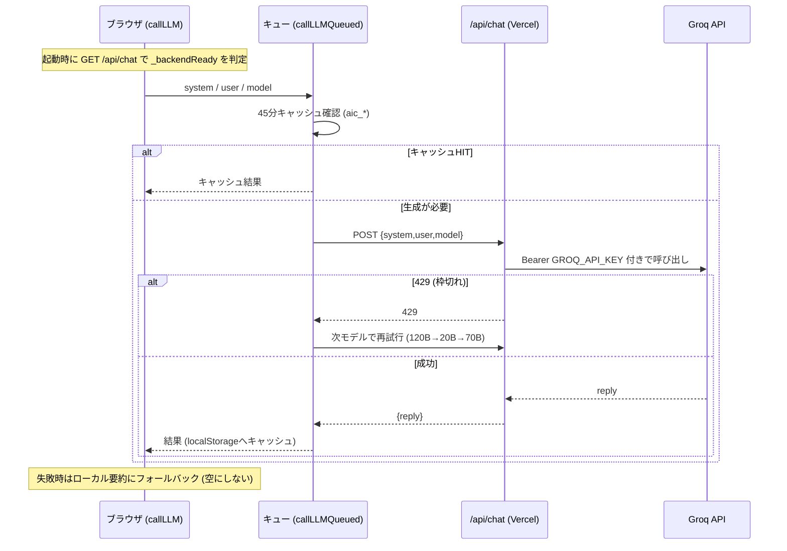
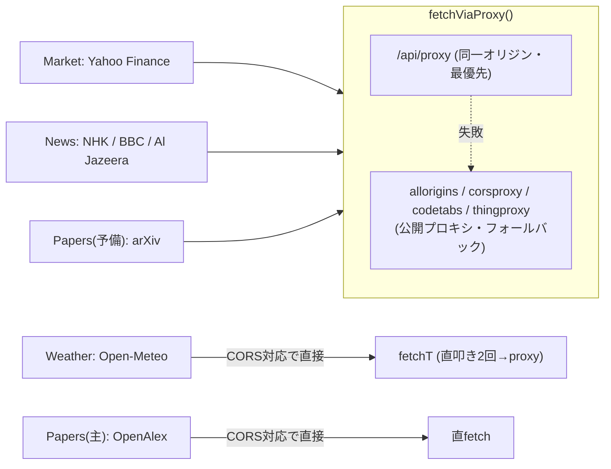
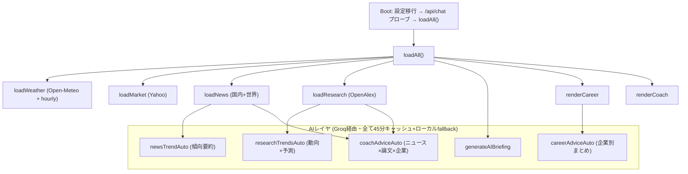
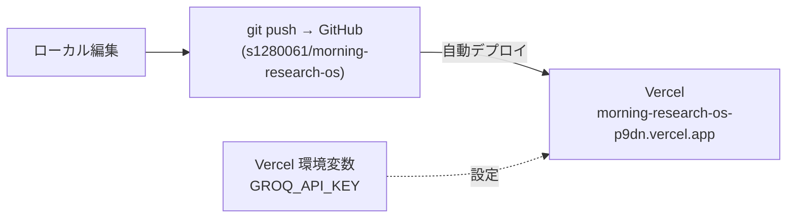

# Morning Research OS — アーキテクチャ設計図

自動運転・AI研究者向けの「研究パーソナルOS」PWA。
**フロントは静的サイト（バニラJS）**、**APIキーや混雑しやすい外部APIはVercelのサーバーレス関数が代理**する構成。

> 画像版: [docs/architecture.png](docs/architecture.png) ／ 高解像度 [docs/architecture@2x.png](docs/architecture@2x.png) ／ ベクター [docs/architecture.svg](docs/architecture.svg)

---

## 1. システム全体構成

---

## 2. AIリクエストの流れ（キーをブラウザに出さない）

**フォールバックの段階**
1. サーバキー(`/api/chat`) → 2. ブラウザのキー(localStorage) → 3. ローカル要約（ニュース/論文/天気から生成）

---

## 3. データ取得の流れ（プロキシと直接の使い分け）

| データ | ソース | 取得方法 | 堅牢化 |
|---|---|---|---|
| 天気 / 時間帯予報 | Open-Meteo | 直fetch→失敗時proxy | リトライ + 既定座標fallback + 結果キャッシュ |
| 論文 | OpenAlex（主）→ arXiv API → RSS | 直fetch / proxy | 多段フォールバック + キャッシュ優先表示 |
| 株価 | Yahoo Finance | proxy | 公開proxy多段フォールバック |
| ニュース | NHK + BBC + Al Jazeera | proxy | フィード多段フォールバック |
| カレンダーTasks | Google Tasks | クライアントOAuth | ローカルタスクfallback |

---

## 4. フロントエンドのモジュール構成（論理）

---

## 5. 設計の要点（なぜこの構成か）

- **セキュリティ**: APIキーは Vercel 環境変数 `GROQ_API_KEY` に保持し、ブラウザへ出さない（`/api/chat` 代理）。
- **堅牢性 (Robustness first)**: すべての外部依存に「リトライ → 別ソース → キャッシュ → ローカル要約」の多段フォールバック。どの端末でも空白/エラーで止まらない。
- **コスト/レート制限対策**: AI出力を45分 localStorage キャッシュ、Groqモデルの自動フォールバック（120B→20B→70B）。
- **可用性**: クラウドIPが弾かれやすい arXiv/株価は同一オリジンプロキシ＋CDNキャッシュ、CORS対応の OpenAlex/Open-Meteo はブラウザ直叩きで安定。
- **オフライン**: Service Worker（network-first）でPWA化、最低限のシェルとキャッシュ結果を表示。

---

## 6. デプロイ

- 静的ファイル + `/api/*.mjs`（**ESMビルドのため拡張子は必ず `.mjs`**）をVercelが自動デプロイ。
- `vercel.json` でヘッダ/リライト、`sw.js` の `CACHE` 版数更新でクライアント更新を促す。
